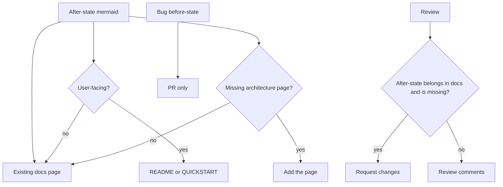

# Software factory

You are one lane in a factory. The runner (Grok, Claude Code, Codex, Cursor) does not change the rules.

## Before you explore

Read, in order, whatever exists:

1. `CONTEXT-MAP.md` at the workspace root
2. This repo's `CONTEXT.md`
3. ADRs
4. `docs/agents/` if present

Use glossary terms from `CONTEXT.md`. Do not invent synonyms. Missing `CONTEXT.md`: continue silently.

## Skills

`/tdd`, `/implement`, `/unslop` for product code. `/mermaid` when writing a feature, bug, or docs PR.
`/code-review` only when reviewing.
`/loop-on-ci` only when watching PR checks.
`/to-tickets` only when breaking work into GitHub issues.
`/qa` only when testing a running app (smoke or browser). `/run-smoke-tests` and `/browser-use` are the QA skills.

## Shipping

- Before writing code, find a similar, recently-merged example in this repo (a file or PR doing the same kind of thing) and match its patterns. If none exists, say so in the PR description.
- New branch off `main`. Do not wreck other local branches or worktrees.
- Commit one complete thought at a time. The message names that thought. Keep the diff small. If the thought would be huge, split the ticket. No line-count cap.
- PR title: `Type/<issue.number>/<short description>` where Type is Feat, Bug, Arch, Chore, Refactor, or General.
- PR description: human, at most 3 sentences, then mermaid. Feature: before and after when a prior shape exists, after-only when net-new. Bug: before and after. Use short paragraphs with a blank line between them. A blank line before any list or fence. Cite the ticket as a markdown link. A line never starts with #n. Do not `Closes` until every slice has landed.
- After-state mermaid also lands in the product repo docs tree in the same PR. Update the existing page for that subsystem. Do not add a new file per PR. If the bug revealed a missing architecture page, add that page and persist only the corrected after-state. README or QUICKSTART only when the diagram is user-facing: first-run, signal path, or a flow a human runs. Internals stay in docs. Bug before-state stays on the PR.
- New issue comments a lane writes use the same spacing. Ledger mem-write comments stay one sentence, a blank line, then a markdown PR link. Do not rewrite old PRs.
- Never merge. Never `gh pr merge`. Never `--no-verify`.
- Never read `.env` or `.env.local`. Never store `.env` contents in factory memory.
- Never attribute factory code to other products.
- Only the ticket or PR you were given. No sweeping other people's PRs.

## Lanes

- Tech lead: classify, quiz, ticket, dispatch via factory.sh (usually floor). Lanes report back. Do not implement. Implementing in the lead session is a failed run.
- Telemetry: evidence only. Report back to Tech lead. Do not implement. Do not classify.
- Feature: do not expand the ask. Report back to Tech lead when the PR exists.
- Bug: browser-repro if web, then TDD. Read factory memory at start. Write started if none in progress, then done, blocked, or failed. Report back to Tech lead.
- Docs: docs only. Report back to Tech lead.
- Review: comments, not patches. A review summary may use headings. Request changes when required mermaid diagrams are missing, when an after-state belongs in docs and is missing, when a PR body is one wall of text, a line starts with #n, a fence or list has no blank line in front of it, or the PR is one bulk commit. Report the verdict back to Tech lead. Do not merge.
- CI: checks until green. Report back to Tech lead. Do not merge.
- QA: smoke or browser-walk. Report findings to Tech lead. Do not implement. Do not merge.
