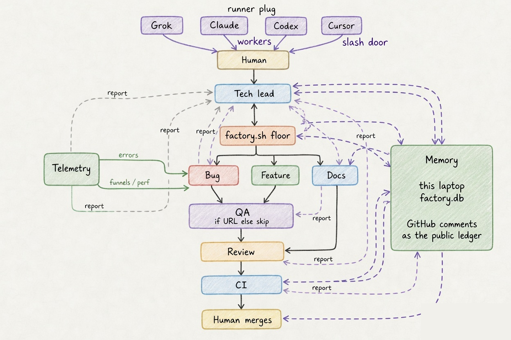

# Software factory

One agent doing the whole job is an intern with admin. A factory is lanes, a ticket, and a human who merges.

Classify the work, cut tracer-bullet tickets, implement on the checkout, smoke it in a browser, review like you hate the PR, watch CI until green. Then a person merges. Agents never merge.

The runner is a plug. Grok, Claude Code, Codex, Cursor. Same `AGENTS.md`, same skills.

Telemetry is a plug too. It is not an error inbox. It watches breakage and whether the product is actually working: funnels on any path, feature completion, time-to-value. Signup drop-off is one signal. So is onboarding, checkout, invite, the core loop, or a shipped feature nobody finishes. PostHog, Datadog, Azure App Insights, CloudWatch speak the same contract. Swap the vendor. Keep the questions.



Editable source: [`docs/factory.excalidraw`](docs/factory.excalidraw).

## How it runs

You open one CLI. `/lead` (or `factory.sh lead`) classifies, quizzes, and tickets. It does not write product code. After tickets exist it starts `factory.sh floor`. Implementing, reviewing, or watching CI in the lead session is a failed run.

Floor is the Tech lead loop in bash. It dispatches **one** isolated `factory.sh` lane, waits, then dispatches the next. Workers are new processes with that lane's rules. Floor never implements. It never merges.

Typical table: implement (feature, bug, or docs) → QA if you passed a URL, else skip QA → review → CI. Telemetry first when the ticket looks like breakage or drop-off and there is no evidence yet. Stop when a person should merge, or when a lane reports `blocked` or `failed`.

Lanes report back. They do not chain themselves. Tech lead (or floor) dispatches the next.

Cursor is a floor door: slash commands in Cursor. `factory.sh` workers are Grok, Claude, or Codex on PATH. Set `FACTORY_RUNNER` if more than one is installed.

## Handoff and hand back

Two ledgers. They stay separate.

**This laptop.** `factory.sh mem write` / `mem read` against `~/.factory/memory/factory.db`. The next `/bug` or `factory.sh feature` on this machine reads those rows at start. A worker writes `started` only if nothing is in progress, then `done`, `blocked`, or `failed`. Missing memory warns once and the lane continues. Optional. Best-effort. Not git. Never `.env`.

**Everyone else.** On `done`, `blocked`, or `failed` (not `started`), the write also comments on the GitHub issue or PR: status, URL, evidence, what next. That comment is the public ledger. Tech lead and another laptop read GitHub when this machine has no rows. Memory is a hint, not a lock.

Floor uses GitHub for "is there a PR, a review, green checks?" Memory on this laptop for `blocked` / `failed` and for "QA was skipped, no URL."

## Lanes

| Lane | Job |
| --- | --- |
| Tech lead | Classify. Quiz. Ticket. Dispatch via `factory.sh` (usually floor). Do not implement. |
| Telemetry | Breakage and product performance. Funnels, feature completion, errors, logs, sessions. Evidence only. Never implements. |
| Bug | Reproduce from evidence. Web bugs: browser first, then TDD fix. |
| Feature | Do not expand the ask. TDD, implement, unslop. |
| Docs | Docs only. |
| Review | Harsh maintainability review. Comments, not patches. |
| CI | `gh pr checks` until green. Failures only. |
| QA | Smoke or browser-walk a running app. Report only. |

## Install

```bash
git clone https://github.com/Kripu77/software-factory.git
cd software-factory
./install.sh
```

Install creates `~/.factory/memory`. It does not touch other memory plugins.

One pack. Four harnesses.

| Harness | How it loads |
| --- | --- |
| Cursor | local plugin at `~/.cursor/plugins/local/software-factory` |
| Claude Code | skills + slash commands under `~/.claude` |
| Grok Build | plugin at `~/.grok/plugins/software-factory` (`grok plugin install . --trust`) |
| Codex | skills under `~/.codex/skills` plus `AGENTS.md` in the product checkout |

Then set the product checkout:

```bash
export FACTORY_WORKSPACE=/path/to/your/checkout
export FACTORY_OWNER=your-github-org
```

## Run

Open the CLI and start at lead:

- `/lead` with owner/repo#issue

Or one lane, still one ticket:

- `/feature` with owner/repo#issue
- `/bug` with owner/repo#issue
- `/review` with owner/repo#pr
- `/ci` with owner/repo#pr
- `/qa` with a URL or owner/repo#pr
- `/telemetry` with the question
- `/unslop` on any writing
- `/poteto-mode` for the writing and playbook style

Headless (never merges):

```bash
./factory.sh lead   --repo api --issue 12
./factory.sh floor  --repo api --issue 12
./factory.sh feature --repo api --issue 12
./factory.sh bug     --repo api --issue 13
./factory.sh review  --repo api --pr 40
./factory.sh ci      --repo api --pr 40
./factory.sh telemetry --question "login 500s last 24h"
./factory.sh qa --repo frontend --pr 12 --url http://localhost:3000
./factory.sh mem write --lane feature --status started --issue 12 --harness grok --summary "Add the memory store"
./factory.sh mem read --issue 12
```

`factory.sh ship` is an alias of `floor`. QA URL is `--url` or `FACTORY_QA_URL`.

## Hard rules

- Never merge. A person merges.
- Never `git commit --no-verify`.
- Never read or send `.env` / `.env.local`. Never store `.env` in factory memory.
- Never attribute factory code to other products.
- Only the ticket or PR you were given.
- Issues live on the owning service, not a catch-all.
- PR title: `Type/<issue.number>/<short description>` (`Feat`, `Bug`, `Arch`, `Chore`, `Refactor`, `General`).

## Telemetry

See [`telemetry/CONTRACT.md`](telemetry/CONTRACT.md). Breakage and product performance. Funnels are any instrumented path, not one screen. Session replay is optional. If the vendor cannot replay or cannot funnel, say so. Do not invent either.
