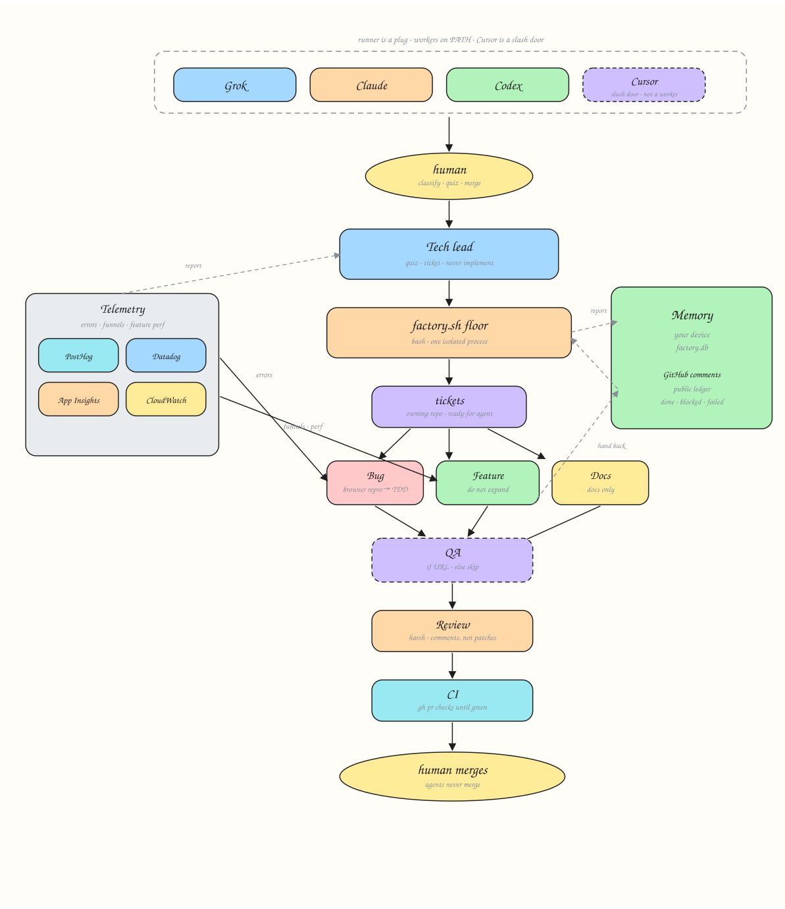

# Software factory

One agent doing the whole job is an intern with admin. A factory is lanes, a ticket, and a human who merges.

Build software this way: classify the work, cut tracer-bullet tickets, implement on the checkout, review like you hate the PR, watch CI until green. Review then merge. Agents never merge.

The runner is a plug. Grok, Claude Code, Codex, Cursor. Same `AGENTS.md`, same skills.

Telemetry is a plug too. It is not an error inbox. It watches breakage and whether the product is actually working: funnels on any path, feature completion, time-to-value. Signup drop-off is one signal. So is onboarding, checkout, invite, the core loop, or a shipped feature nobody finishes. PostHog, Datadog, Azure App Insights, CloudWatch speak the same contract. Swap the vendor. Keep the questions.



Editable source: [`docs/factory.excalidraw`](docs/factory.excalidraw).

## Lanes

| Lane | Job |
| --- | --- |
| Tech lead | Classify. Quiz. Ticket on the owning repo. Dispatch. Do not implement. |
| Telemetry | Breakage and product performance. Funnels, feature completion, errors, logs, sessions. Evidence only. Never implements. |
| Bug | Reproduce from evidence, then TDD fix. |
| Feature | Do not expand the ask. TDD, implement, deslop. |
| Docs | Docs only. |
| Review | Harsh maintainability review. Comments, not patches. |
| CI | `gh pr checks` until green. Failures only. |

## Install

```bash
git clone https://github.com/Kripu77/software-factory.git
cd software-factory
./install.sh
```

Links skills into `~/.grok/skills` and `~/.claude/skills`. Drop `AGENTS.md` into each repo the factory should see.

Point the factory at your product:

```bash
export FACTORY_WORKSPACE=/path/to/your/checkout   # or a folder of service clones
export FACTORY_OWNER=your-github-org              # or your user
export FACTORY_RUNNER=grok                        # grok | claude | codex
```

## Run

```bash
./factory.sh feature --repo api --issue 12
./factory.sh bug     --repo api --issue 13
./factory.sh review  --repo api --pr 40
./factory.sh ci      --repo api --pr 40
./factory.sh telemetry --question "login 500s last 24h"
./factory.sh telemetry --question "where does onboarding die, last 7d"
```

`--runner` overrides `FACTORY_RUNNER`. `--yes` auto-approves tool calls where the CLI allows it. `ship` runs implement, then review, then CI. Still does not merge.

## Hard rules

- Never merge. A person merges.
- Never `git commit --no-verify`.
- Never read or send `.env` / `.env.local`.
- Only the ticket or PR you were given.
- Issues live on the owning service, not a catch-all.
- PR title: `Type/<issue.number>/<short description>` (`Feat`, `Bug`, `Arch`, `Chore`, `Refactor`, `General`).

## Telemetry

See [`telemetry/CONTRACT.md`](telemetry/CONTRACT.md). Breakage and product performance. Funnels are any instrumented path, not one screen. Session replay is optional. If the vendor cannot replay or cannot funnel, say so. Do not invent either.
